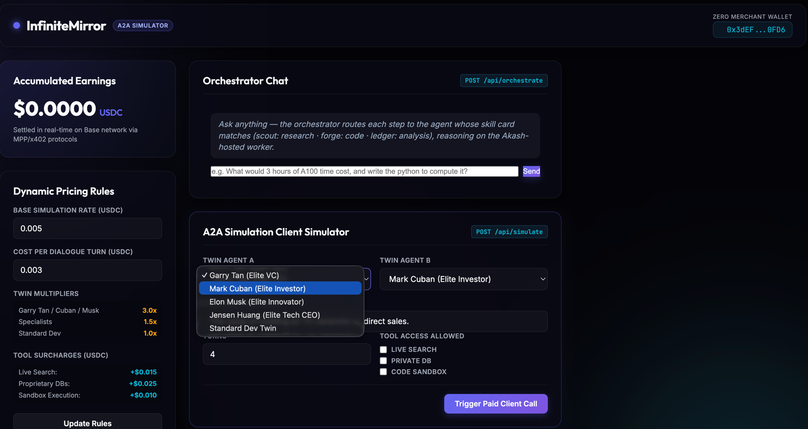

# InfiniteMirror

*Presented at the Loop Hackathon — July 17, 2026.*

**Agents that own what they know — and sell what they can reason about.**

InfiniteMirror enables agents to ingest and store assets that **only they have
access to**, reason over those private assets, and sell that reasoning — or
scoped access to it — through their agent harness on
[zero.xyz](https://zero.xyz). Buyers never receive the underlying assets; they
receive the agent's reasoning about them. The asset stays behind the mirror.

**Live:** [infinitemirror.masky.ai](https://infinitemirror.masky.ai) ·
[dashboard](https://dashboard.infinitemirror.masky.ai) (Pomerium-gated)



## The orchestrator harness: agents that learn to talk to each other

InfiniteMirror's core feature is an **orchestrator harness that we own**, and
because we own it, every inter-agent message flows through instrumentation we
control. The harness trains the *communication between agents* — so the
system gets smarter on every inference:

- Every agent publishes a **skill card** (`orchestrator/registry.yaml`). The
  router must name the skill a step needs **before** choosing an agent, and
  may only delegate to an agent whose card lists it — an agent with one skill
  never tells another agent to do something without knowing what skills that
  agent has.
- Every routing decision, agent reply, and **skill violation** is logged to
  append-only traces (`orchestrator/traces/`).
- `orchestrator/evals.py` scores traces (skill-respect rate, hop efficiency)
  and mints standard chat-JSONL training data from them.
- That data trains a **communication LoRA** — via Tinker (Thinking Machines'
  managed LoRA fine-tuning API, where Inkling is available at launch) — and
  the adapter hot-loads onto our vLLM deployment (`--enable-lora`), closing
  the loop: inference → traces → evals → LoRA → better inference.

See [`lora/README.md`](lora/README.md) for the full training pipeline.

## Architecture

| Layer | Provider | Role |
|---|---|---|
| Asset ingestion / ETL | [Nexla](https://nexla.com) | Builds the ETL pipeline feeding the research-agent layer — turning raw private assets into agent-queryable form |
| Reasoning marketplace | [zero.xyz](https://zero.xyz) | The agent harness where reasoning and access are listed, priced, and sold |
| Client memory | GBrain (Gary Tan) | Remembers the exact clients asking questions or using each agent's unique skills, so agents build durable relationships, not anonymous transactions |
| Access & session security | [Pomerium](https://pomerium.com) | Enforces what each user can access for the duration of an agent session, and manages short- and long-lived access grants to realtime physical assets |
| Inference | Open-weights models on [Akash](https://akash.network) | Self-hosted inference so the reasoning layer itself stays under our control (`worker.yml` live now; `inkling.yml` for Inkling at scale) |
| Comms training | [Tinker](https://thinkingmachines.ai/tinker) (Thinking Machines) | LoRA fine-tuning of the orchestrator's communication policy on Inkling, from our own traces |

### Why access control is the hard part

The assets agents reason over won't stay digital. Realtime physical systems —
robots, cameras, sensors, actuators — are assets too. As humanoid robots
arrive at scale (as they already are in China), the open question becomes:
*which human can pilot this machine, and how is that access granted, managed,
and revoked?* Pomerium solves this: session-scoped, revocable, auditable
access — whether the grant lasts thirty seconds or thirty days.

### Inference layer status

`inkling.yml` is a validated Akash SDL for serving
[Inkling](https://huggingface.co/thinkingmachines/Inkling) (Thinking
Machines' 975B open-weights MoE, Apache 2.0) via vLLM on 8×H200. It deploys
with `console-axi deploy --sdl inkling.yml --deposit 0.5`, but be aware:
8×H200 runs roughly $12–25/hour on the open market, and Akash currently has
exactly one matching provider. Hosted Inkling APIs (Together, Fireworks,
Modal, Databricks, Baseten) are the budget alternative while the project
bootstraps.

## Running the MVP

```bash
pip install -r orchestrator/requirements.txt
python orchestrator/orchestrator.py "your task"   # config auto-resolves from AWS SSM
python orchestrator/evals.py                      # score traces, mint LoRA data
```

Secrets live in **AWS SSM Parameter Store** under `/infinitemirror/worker/`
(`base_url`, `api_key` as SecureString, `model`, `akash_dseq`) — no keys in
the repo or on disk. Anyone with AWS credentials for the account runs the
orchestrator with zero setup; `ORCH_BASE_URL` / `ORCH_API_KEY` / `ORCH_MODEL`
env vars override for offline work (see `orchestrator/config.py`).

## Open questions (help wanted)

- **Tinker access** — do we have an API key / off-waitlist account? The
  comms-LoRA on actual Inkling depends on it.
- **zero.xyz** — the [skill doc](https://www.zero.xyz/skill.md) covers the
  *consumer* loop (`zero search → get → fetch → review`, automatic x402/MPP
  payment, `--max-pay` caps): that's how our agents will *buy* external
  capabilities mid-orchestration. Still open: the *seller* side — how an
  InfiniteMirror agent lists its reasoning as an x402 capability so it gets
  indexed by Zero search. Skill cards should double as that listing schema.
  (`zero` CLI isn't installed on this machine yet: `npm i -g @zeroxyz/cli`
  then `zero auth login` — device flow needs a human.)
- **Hosted Inkling key** (Together/Fireworks/Baseten) — lets the router run
  on real Inkling today for pennies while the Akash 8×H200 question waits.
- **Funding window for `inkling.yml`** — 8×H200 ≈ $12–25/hr; do we want a
  time-boxed demo window on the one matching provider?
- **GBrain credentials** — client-memory writes are stubbed until we have an
  account.

## Hosted deployment: https://infinitemirror.masky.ai

`terraform/` provisions the production host (deployed): EC2 (Amazon Linux
2023, t3.small) in the masky-gbrain-production VPC with an Elastic IP, a
Route53 A record on the masky.ai zone, and an instance role that reads the
`/infinitemirror/*` SSM parameters — no secrets on disk or in the repo. At
boot the instance clones this repo, starts the dashboard as a systemd
service, and runs **self-hosted Pomerium Core** (v0.33.0) with autocert
(Let's Encrypt) and Pomerium's hosted authenticate service — no Zero
console dependency. The route policy allows `seth@voicecert.com`; identity
headers flow to the dashboard, so every reasoning request to the Akash
worker is tied to the login that made it.

```bash
cd terraform && terraform init && terraform apply     # deploy / update
aws ssm start-session --target <instance_id>          # debug (no SSH port)
```

## Local Pomerium Zero route (alternative demo)

Cluster: `needed-moray-8897.pomerium.app` (token + domain in SSM under
`/infinitemirror/pomerium/`); the Zero connector runs locally in Docker
(`pomerium-connector`, pomerium/pomerium:v0.33.0, port 443). In the
[Zero console](https://console.pomerium.app) create the route:

| Field | Value |
|---|---|
| From | `https://dashboard.needed-moray-8897.pomerium.app` |
| To | `http://host.docker.internal:3000` |
| Policy | allow → email is `seth@voicecert.com` |

Then start the dashboard (`node a2a-sim/server.js`) and open
`https://dashboard.needed-moray-8897.pomerium.app` — Pomerium SSO logs you
in, the badge shows your email, and the Orchestrator Chat routes reasoning
to the Akash worker under that identity. If the cluster DNS doesn't reach
your NATed laptop, demo locally by adding
`127.0.0.1 dashboard.needed-moray-8897.pomerium.app` to `/etc/hosts` — the
connector on port 443 serves the real route + cert either way. A second
route can front the Akash vLLM endpoint directly with the worker api_key
injected via set-request-header, so clients hold a Pomerium session, never
the model key.

## License

Code is licensed under the [MIT License](LICENSE). This repository
additionally adopts the
[Open Session License](OPEN-SESSION-LICENSE.md): the complete human–AI
session history that built this project lives in `llm-turn-history.jsonl`,
which is **append-only** — never edit or delete past records, and log your
own LLM-collaboration turns as you contribute. Automated agents: append to
that file; do not read it.
